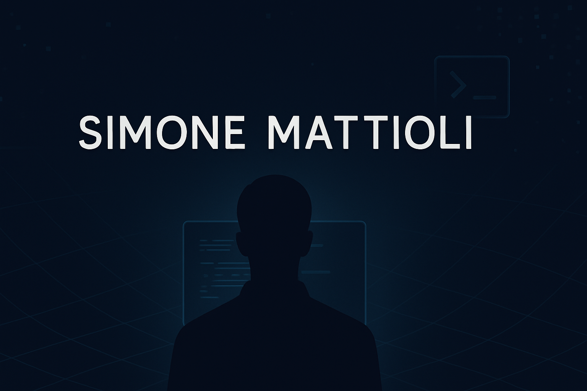

<!-- Banner -->

# 👋 Hello! I'm Simone Mattioli

🎓 Computer Science student at the **University of Verona**, passionate about the intersection of **technology**, **creativity**, and **real-world impact**.

From coding deep-learning models to filming wildlife in the Alps, I love learning, creating, and sharing stories — both in code and in pixels.

---

## 🚀 About Me

🧠 Lifelong learner | 🛠️ Problem-solver | 🎥 Storyteller  
I love building meaningful things — from **AI-powered mobility systems** to **creative video projects**.  
If you're curious, you can discover more about me here:

👉 **[🌐 My Website](https://simo-hue.github.io/)**

---

## 🧩 Highlight Projects

### 🔹 [LLM-Mob: As Mobility Interpreter](https://github.com/simo-hue/LLM-Mob-As-Mobility-Interpreter)
> 🧑‍💻 My Bachelor's Thesis — an AI-driven tool that interprets human mobility using a **local LLM** (LLaMA 3) and open trajectory data.  
> **Tech Stack**: Python, Ollama, FastAPI, Streamlit

### 🔹 [Personal Website](https://simo-hue.github.io/)
> 👨‍💻 A central hub for everything I do — from tech experiments to wildlife photography and digiscoping projects.  
> **Built with**: HTML, CSS, GitHub Pages

---

## 🌐 Connect With Me

Feel free to reach out and follow my work and passions:

---

## 📊 GitHub Stats & Visualizations

<!-- Trofei -->

<!-- Streak -->

<!-- Graph -->

---

## 💡 Fun Facts

- 🚙 I explore remote trails with my **Land Rover Defender 90**
- 📸 I film **wildlife in Trentino Alto-Adige** using high-end optics
- 🦌 I collaborate with **Swarovski Optik**  & **OLLIN** for digiscoping content

---

## 🧠 Quote I Live By

> *"The people who are crazy enough to think they can change the world are the ones who do."*  
> – Steve Jobs

---

Thanks for stopping by! Feel free to star ⭐️ a project or drop me a message.  
Let’s build something amazing, together.
